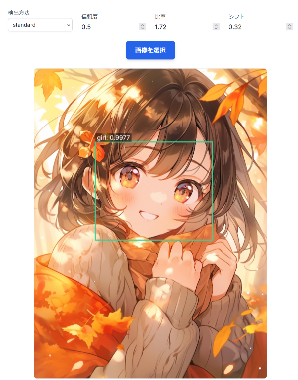

# Anime_face_detection_api
アニメ顔検出API。フォーク元の [animede/anime_face_detection](https://github.com/animede/anime_face_detection) をDockerに載せてWeb APIとして整備 + Web I/Fを追加したもの。



# 利用方法
## 1. ビルド
```sh
docker compose build
```

チェックポイントのダウンロードもDockerfileの中で行っている。

## 2. 起動
```sh
docker compose up -d
```

* 8081番ポートでAPIが待ち受け開始する。
* 動作確認用のWebページが http://localhost:8080 で起動する。
* ポート番号がバッティングする場合は適宜 `compose.yaml` または `compose.override.yaml` を更新すること。

## 3. 動作確認 (Web I/F)
http://localhost:8080 を開いて画像をアップロードすると、顔認識の結果が表示される。

## 4. 動作確認 (curl)
```sh
$ curl -s "http://localhost:8081/face/?type=square&confidence_level=0.5" \
    -F "file=@images/anime-girl-in-autumn.jpg" | jq
{
  "character_count": 1,
  "image_size": [
    1446,
    1920
  ],
  "data": [
    {
      "score": 0.9987442493438721,
      "box": [
        386,
        451,
        1112,
        1064
      ],
      "label": "girl"
    }
  ]
}
```

* やっていることは上記の動作確認用Web I/Fとまったく同じ。
* 画像ファイルだと決め打ちしてOpenCVに渡して処理しているため `Content-Type` の指定は必須ではない。
